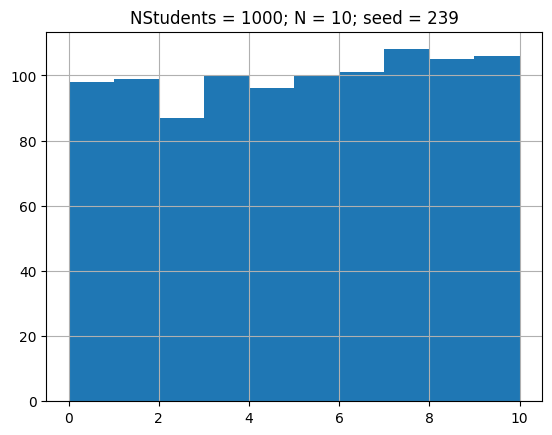
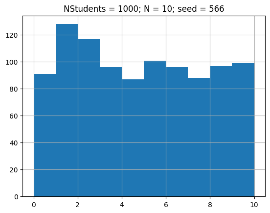
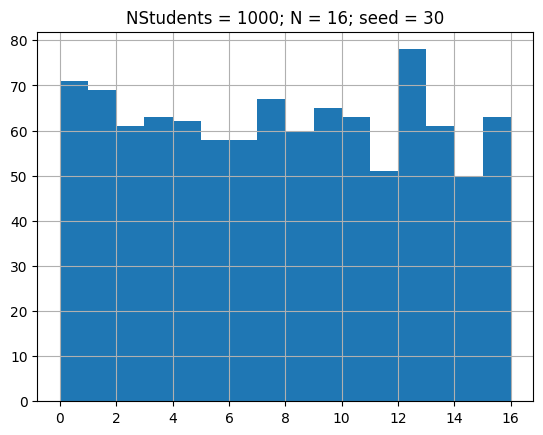
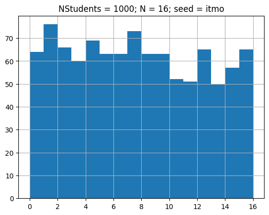

# Homework 7

#### _“Symmetric cryptography”_

Скрипт `gentickets.sh` по данному списку студентов, числу билетов и ключу генерирует номер билета для каждого студента.  

Принимает на вход три параметра:
+ название файла со списком студентов
+ количество билетов
+ ключ (произвольная строка)


## Пример использования

#### students.txt
```
Ivan Petrov
Petr Ivanov
Dmitrii Rogulin
```

#### Команда
```shell
./gentickets.sh students.txt 30 566
```


#### Результат
```
Ivan Petrov: 5
Petr Ivanov: 26
Dmitrii Rogulin: 22
```

## Алгоритм генерации билета

Для каждой строчки `line` номер билета строится по следующей формуле:
```
ticket(line, N, seed) = sha3-512(line.concat(seed)) % N + 1
```
То есть к строчке в конец приписывается ключ, от этого вычисляется `SHA3-512` хэш,
берется остаток от деления на количество билетов и прибавляется единица.  
Таким образом, каждой строчке однозначно сопоставляется номер билета.
Причем, в силу свойства рассеивания `SHA3`, при малейшем изменении строчки и/или ключа,
результат непредсказуемо изменится.

## Детали реализации

+ `SHA3-512` хэш генерируется при помощи `openssl`, конкретно командой
    ```shell
    openssl dgst -sha3-512
    ```
+ К строке, помимо ключа, неявно приписывается еще и символ перевода строки (`\n`)
+ По каким-то непонятным причинам, для строк с пробелами, скрипт генерирует не тот хэш.
Вероятно, что-то происходит с кодировкой пробелов на каком-то этапе. 
Но в любом случае, `sha3` хэш тем не менее вычисляется и для одинаковых строк скрипт генерирует одинаковый номер билета,
поэтому эта особенность не влияет на криптостойкость и корректность. Распределение получается равномерным, как показано ниже.
+ Чтобы последняя строчка считалась, входной файл должен заканчиваться пустой строкой 


## Небольшое тестирование

Посмотрим на различные распределения билетов для [списка](test/students_big.txt) из 1000 студентов
(файл сгенерирован на сайте [randomtools.io](https://randomtools.io/dev-tools/data-generator/))  
По хорошему, конечно надо проводить статистический анализ, для точного вывода о том,
достаточно ли распределения равномерные, но ограничимся лишь графиками.





